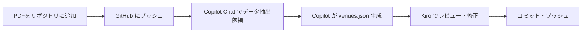

# GitHub Copilot との連携ガイド

## リポジトリ作成時の注意点

### 1. リポジトリ構造

```
concert-venues/
├── .github/
│   └── copilot-instructions.md  # Copilot用の指示書
├── data/
│   ├── source-documents/        # PDFなどのソースファイル
│   └── handwritten-data.json    # 手書きデータ
├── public/
│   └── data/
│       └── venues.json          # 最終的なデータ
├── docs/
│   ├── DATA_STRUCTURE.md        # データ構造の説明
│   └── EXTRACTION_GUIDE.md      # データ抽出ガイド
└── README.md                    # プロジェクト概要
```

### 2. 重要なファイル

#### `.github/copilot-instructions.md`
GitHub Copilotがリポジトリ全体のコンテキストを理解するための指示書を配置します。

```markdown
# Copilot Instructions

このリポジトリは東京23区の公共コンサート会場データベースです。

## データ構造
- `public/data/venues.json`: 最終的な会場データ（JSON形式）
- `data/source-documents/`: 各区のPDFファイル
- `data/handwritten-data.json`: 手書きメモデータ

## データ抽出ルール
1. 施設名、住所、最寄り駅、収容人数、料金を抽出
2. 既存のvenues.jsonと同じフォーマットで出力
3. 不明な項目は null または適切なデフォルト値を使用

## コーディング規約
- TypeScript/JavaScript: ESLint + Prettier
- JSON: 2スペースインデント
- 日本語コメント推奨
```

#### `docs/DATA_STRUCTURE.md`
データ構造を明確に文書化します。

```markdown
# データ構造

## venues.json フォーマット

\`\`\`typescript
interface Venue {
  id: string;                    // ユニークID（例: "shibuya-bunka-1"）
  name: string;                  // 施設名
  address: string;               // 住所
  prefecture: string;            // 都道府県
  city: string;                  // 市区町村
  ward: string;                  // 区
  station: string;               // 最寄り駅
  stationWalkMinutes: number;    // 駅からの徒歩時間（分）
  capacity: number;              // 収容人数
  price: number;                 // 料金（円）
  priceNote?: string;            // 料金に関する注記
  facilities: {
    piano: "grand" | "upright" | "none";
    soundSystem: boolean;
    lighting: boolean;
    airConditioning: boolean;
    parking: boolean;
  };
  conditions: {
    residentOnly: boolean;       // 区民限定か
    residentDiscount: boolean;   // 区民割引があるか
    advanceBookingDays: number;  // 事前予約可能日数
  };
  reservationUrl?: string;       // 予約URL
  officialUrl?: string;          // 公式URL
  description?: string;          // 説明
  createdAt: string;             // 作成日時（ISO 8601）
  updatedAt: string;             // 更新日時（ISO 8601）
}
\`\`\`

## ID命名規則
- フォーマット: `{区名}-{施設名略称}-{連番}`
- 例: `shibuya-bunka-1`, `setagaya-kumin-1`
- 小文字、ハイフン区切り
```

### 3. README.md の充実

```markdown
# 東京23区 公共コンサート会場データベース

## プロジェクト概要
東京23区の公共施設で楽器演奏・コンサートが可能な会場の情報をまとめたデータベースです。

## データソース
- 各区の公共施設予約システムのPDF
- 手書き調査メモ
- 公式ウェブサイト

## 使い方

### データの追加・更新
1. `data/source-documents/` にPDFを配置
2. データ抽出スクリプトを実行
3. `public/data/venues.json` を確認

### GitHub Copilot での作業
Copilotに以下のように依頼してください：

\`\`\`
data/source-documents/大田区/ のPDFファイルから施設情報を抽出して、
venues.json フォーマットで出力してください。
\`\`\`

## データ構造
詳細は [docs/DATA_STRUCTURE.md](docs/DATA_STRUCTURE.md) を参照してください。
```

### 4. Git管理の注意点

#### `.gitignore`
```
# 依存関係
node_modules/
.next/

# 環境変数
.env
.env.local

# ビルド成果物
dist/
build/

# IDE
.vscode/
.idea/

# OS
.DS_Store
Thumbs.db

# 一時ファイル
*.tmp
*.log

# 大きなPDFファイルは Git LFS を使用
# *.pdf
```

#### Git LFS の使用（推奨）
PDFファイルが大きい場合は Git LFS を使用します：

```bash
# Git LFS のインストール
brew install git-lfs  # macOS
git lfs install

# PDFファイルをLFS管理下に
git lfs track "*.pdf"
git add .gitattributes
```

### 5. GitHub Copilot との連携フロー



### 6. Copilot への効果的な依頼方法

#### 良い例 ✅
```
@workspace data/source-documents/大田区/公共施設予約システム（施設絞り込み（場所選択））_音楽練習（器楽練習等）.pdf
から施設情報を抽出して、docs/DATA_STRUCTURE.md に記載されているフォーマットで
JSONデータを作成してください。既存の public/data/venues.json に追加する形で出力してください。
```

#### 悪い例 ❌
```
PDFから情報を取ってください
```

### 7. Kiro と Copilot の役割分担

| タスク | Kiro | GitHub Copilot |
|--------|------|----------------|
| PDFからのデータ抽出 | △ | ◎ |
| JSONデータの整形 | ◎ | ◎ |
| データの検証 | ◎ | △ |
| コードの実装 | ◎ | ◎ |
| リポジトリ操作 | ◎ | △ |
| 大量データの処理 | △ | ◎ |

### 8. ワークフロー例

#### ステップ1: リポジトリ作成（Kiro）
```bash
cd concert-venues
git init
git add .
git commit -m "Initial commit"
gh repo create concert-venues --public --source=. --push
```

#### ステップ2: PDFデータ抽出（Copilot）
GitHub Copilot Chat で：
```
@workspace data/source-documents/ 内のすべてのPDFファイルから
施設情報を抽出して、venues.json に追加してください。
```

#### ステップ3: データ検証（Kiro）
```bash
# Kiro でデータの整合性をチェック
npm run validate-data
```

#### ステップ4: コミット（Kiro）
```bash
git add public/data/venues.json
git commit -m "Add venues data from PDFs"
git push
```

## トラブルシューティング

### Copilot がPDFを読めない場合
1. PDFをテキスト化してコミット
2. 画像として認識させる
3. 手動でテキスト抽出してマークダウン化

### データ形式が合わない場合
1. `docs/DATA_STRUCTURE.md` を参照するよう明示的に指示
2. サンプルデータを提示
3. TypeScript の型定義を提供

## 参考リンク
- [GitHub Copilot Documentation](https://docs.github.com/en/copilot)
- [Git LFS](https://git-lfs.github.com/)
